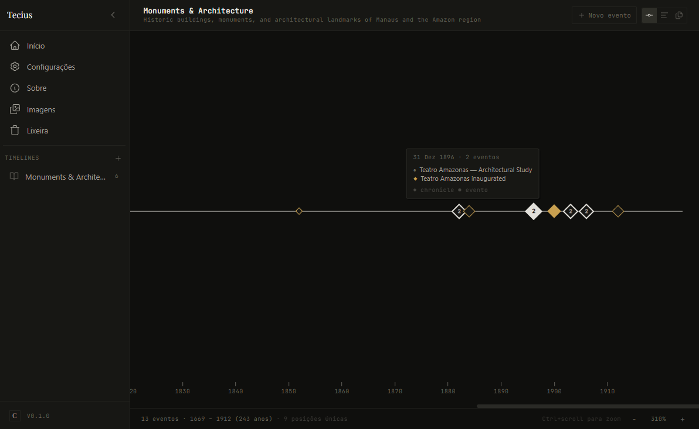

<div align="center">

<br />

# Tecius

**A personal historical timeline manager powered by plain Markdown files.**

*Organize events, periods, and narratives in a visual timeline — fully local, fully yours.*

<br />

[](LICENSE)
[](https://github.com/luiscriativo/tecius/releases/latest)
[](https://www.electronjs.org/)
[](https://www.typescriptlang.org/)
[](https://reactjs.org/)
[](#installing)

<br />

[**⬇ Download for Windows**](https://github.com/luiscriativo/tecius/releases/latest) · [View all releases](https://github.com/luiscriativo/tecius/releases) · [User Guide](docs/GUIDE.md)

<br />



<br />

</div>

---

## What is Tecius?

Tecius is a **desktop app for building and exploring historical timelines** using plain `.md` files stored on your own machine. Inspired by [Obsidian](https://obsidian.md/), it uses a **vault** — just a regular folder — as its database. Every event, timeline, and chronicle is a Markdown file you can open, edit, move, or back up with any tool you already use.

No proprietary formats. No cloud lock-in. No subscriptions. Your data stays exactly where you put it.

---

## Why Tecius?

There are many tools for notes and knowledge management. Tecius does something different:

| | Tecius | Notion | Obsidian |
|---|---|---|---|
| Visual timeline canvas | ✅ | ❌ | ❌ (plugin only) |
| Plain Markdown storage | ✅ | ❌ | ✅ |
| 100% offline & local | ✅ | ❌ | ✅ |
| Free, no subscription | ✅ | ❌ | ✅ |
| Built for chronological data | ✅ | ❌ | ❌ |
| Chronicles (multi-entry events) | ✅ | ❌ | ❌ |

If you want to map **when things happened** — a biography, a historical research project, a personal diary, a company history — Tecius is purpose-built for that.

---

## Features

**📁 Vault-based storage**
Open any folder as a vault. Timelines are subfolders; events are `.md` files. The structure is human-readable and fully portable.

**🗓 Canvas & List views**
Visualize events on a horizontal timeline canvas with smooth zoom (Ctrl+scroll or ± buttons) or switch to a compact list view grouped by year.

**📜 Chronicles**
A single `.md` file can contain multiple events using the `chronicle` type. Perfect for grouping related milestones — a biography, a project history, a series of related facts.

**🏷 Categories & Importance**
Classify events by category (Politics, Art, Science, Music…) and assign an importance level from 1 to 5 to control their visual weight on the timeline.

**🗂 Sub-timelines**
Timelines can be nested freely. A subfolder inside a timeline becomes a sub-timeline — navigate through levels with the breadcrumb bar.

**🗑 Internal Trash**
Deleted events move to an internal trash folder inside the vault. Nothing is permanently removed without your explicit confirmation.

**📦 Asset management**
Keep images, PDFs, and references alongside your events in the `_assets/` folder. Assets are associated per timeline and can be referenced in event bodies.

**📄 PDF Export**
Export any timeline as a print-ready PDF directly from the timeline view.

**🔄 Auto-update**
Built-in updater checks for new releases and downloads them inside the app — no manual re-downloading needed.

**🌍 Internationalization**
Interface available in **Portuguese (PT)** and **English (EN)**.

**🎨 Dark & Light themes**
Full dark and light mode support with a typographic design system inspired by 19th-century documents.

---

## Installing

Download the latest release for your platform:

| Platform | Download |
|---|---|
| **Windows** | [Tecius Setup .exe](https://github.com/luiscriativo/tecius/releases/latest) (installer) or portable `.exe` |
| macOS | `.dmg` *(coming soon)* |
| Linux | `.AppImage`, `.deb`, or `.rpm` *(coming soon)* |

> **Windows SmartScreen warning:** Tecius is unsigned (code signing certificates are expensive). Click "More info" → "Run anyway" to proceed. The app is fully open source — you can read every line of code in this repository.

---

## Vault Structure

A vault is just a folder. Here is a typical structure:

```
my-vault/
├── _vault.md                              # Vault title and metadata
│
├── Amazon History/                        # A timeline
│   ├── _timeline.md                       # Timeline metadata
│   ├── 1541-02-12_orellana-expedition.md  # A single event
│   ├── 1896-12-31_teatro-amazonas.md      # A single event
│   ├── amazon-rubber-boom.md              # A chronicle (multiple events)
│   ├── indigenous-peoples.md             # A chronicle
│   │
│   └── Monuments & Architecture/          # A sub-timeline
│       ├── _timeline.md
│       ├── 1882-10-15_mercado-adolpho-lisboa.md
│       ├── 1896-12-31_teatro-amazonas-architecture.md
│       └── manaus-belle-epoque.md         # Chronicle
│
└── _assets/
    └── cover.jpg
```

For a full explanation of frontmatter fields, event types, and chronicles, see the **[User Guide](docs/GUIDE.md)**.

---

## Roadmap

These are features planned or under consideration. Community feedback helps prioritize them.

- [ ] macOS and Linux builds
- [ ] Timeline export to HTML (shareable static page)
- [ ] Event linking (reference one event from another)
- [ ] Search across the entire vault
- [ ] Custom categories and color theming per timeline
- [ ] Multiple vault support (quick switching)
- [ ] Mobile companion app (read-only)

Have an idea? [Open an issue](https://github.com/luiscriativo/tecius/issues) and let's discuss it.

---

## Development

### Prerequisites

- **Node.js** 20+ (LTS recommended)
- **npm** 10+

### Setup

```bash
git clone https://github.com/luiscriativo/tecius.git
cd tecius
npm install
```

### Running in development

```bash
npm run dev
```

This starts the Vite dev server with HMR and launches the Electron window. Changes to renderer code apply instantly. Changes to the main process or preload trigger an Electron restart.

### Type checking

```bash
npm run typecheck
```

### Linting

```bash
npm run lint
npm run lint:fix
```

### Building for production

```bash
# Build only (no installer)
npm run build

# Windows — NSIS installer + portable
npm run build:win

# macOS — DMG + ZIP
npm run build:mac

# Linux — AppImage + DEB + RPM
npm run build:linux
```

Output is placed in the `dist/` directory.

---

## Project Structure

```
src/
├── main/                        # Electron main process (Node.js)
│   ├── index.ts                 # Window creation, app lifecycle
│   ├── ipc/                     # IPC handlers (fs, app, window)
│   └── services/
│       └── FileSystemService.ts # All disk operations
│
├── preload/
│   └── index.ts                 # contextBridge API surface
│
└── renderer/src/                # React application
    ├── App.tsx                  # Router + page map
    ├── components/              # Shared UI components
    │   ├── Sidebar.tsx
    │   └── timeline/            # Canvas, List, EventPanel…
    ├── hooks/                   # useVault, useTimeline, useI18n…
    ├── pages/                   # Home, TimelineView, Settings…
    ├── stores/                  # Zustand stores
    ├── types/
    │   └── chronicler.ts        # Domain types
    └── utils/
        └── chroniclerDate.ts    # Date parsing & formatting
```

---

## Tech Stack

| Layer | Technology |
|---|---|
| Desktop shell | [Electron 33](https://www.electronjs.org/) |
| Bundler | [electron-vite](https://electron-vite.org/) |
| UI framework | [React 18](https://react.dev/) |
| Language | [TypeScript 5](https://www.typescriptlang.org/) |
| Styling | [Tailwind CSS 3](https://tailwindcss.com/) |
| State | [Zustand 5](https://zustand-demo.pmnd.rs/) |
| Routing | [React Router 6](https://reactrouter.com/) |
| Markdown | [gray-matter](https://github.com/jonschlinkert/gray-matter) + [react-markdown](https://github.com/remarkjs/react-markdown) |
| Icons | [Lucide React](https://lucide.dev/) |
| Packaging | [electron-builder](https://www.electron.build/) |

---

## Contributing

Contributions are very welcome — bug reports, feature suggestions, translations, and pull requests all help.

1. **Fork** the repository
2. **Create a branch**: `git checkout -b feat/my-feature`
3. **Commit** following [Conventional Commits](https://www.conventionalcommits.org/): `feat:`, `fix:`, `chore:`, etc.
4. **Push** and open a **Pull Request** describing what you changed and why

For larger changes, please open an issue first so we can discuss the approach before you invest time coding.

**Good first issues:** look for the [`good first issue`](https://github.com/luiscriativo/tecius/labels/good%20first%20issue) label.

---

## License

[MIT](LICENSE) © 2026 [luiscriativo](https://github.com/luiscriativo)

---

<div align="center">

If Tecius is useful to you, consider giving it a ⭐ on GitHub — it helps others discover the project.

</div>
