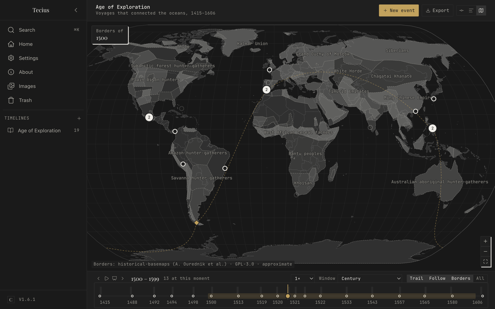
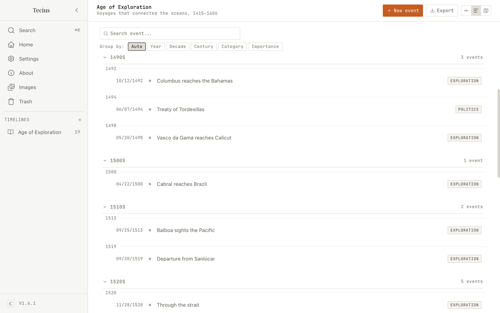

<div align="center">

<br />

# Tecius

**A personal historical timeline manager powered by plain Markdown files.**

*Organize events, periods, and narratives on a visual timeline and a map through time — fully local, fully yours.*

<br />

[](LICENSE)
[](https://github.com/luiscriativo/tecius/releases/latest)
[](https://www.electronjs.org/)
[](https://www.typescriptlang.org/)
[](https://react.dev/)
[](#installing)

<br />

[**⬇ Download**](https://github.com/luiscriativo/tecius/releases/latest) · [All releases](https://github.com/luiscriativo/tecius/releases) · [User Guide](docs/GUIDE.md)

<br />



<br />

</div>

---

## What is Tecius?

Tecius is a **desktop app for building and exploring historical timelines** using plain `.md` files stored on your own machine. Inspired by [Obsidian](https://obsidian.md/), it uses a **vault** — just a regular folder — as its database. Every event, timeline, and chronicle is a Markdown file you can open, edit, move, or back up with any tool you already use.

No proprietary formats. No cloud lock-in. No subscriptions. Your data stays exactly where you put it — and the app works fully offline.

---

## Why Tecius?

| | Tecius | Notion | Obsidian |
|---|---|---|---|
| Visual timeline canvas | ✅ | ❌ | ❌ (plugin only) |
| Map of events through time | ✅ | ❌ | ❌ |
| Plain Markdown storage | ✅ | ❌ | ✅ |
| 100% offline & local | ✅ | ❌ | ✅ |
| Free, no subscription | ✅ | ❌ | ✅ |
| Built for chronological data | ✅ | ❌ | ❌ |
| Chronicles (multi-entry events) | ✅ | ❌ | ❌ |

If you want to map **when and where things happened** — a biography, a historical research project, a personal diary, a company history — Tecius is purpose-built for that.

---

## Features

**🗓 Timeline, list and map views**
- **Timeline** — a horizontal canvas with smooth zoom (Ctrl+scroll or ± buttons), a linear or compressed scale for timelines that span millennia, grouped markers and a minimap. Compare two timelines side by side.
- **List** — a compact chronological list, grouped by year, decade, century, category or importance.
- **Map** — watch events happen on a world map through time: drag the time ruler, press play, or turn it into a full-screen **presentation** with the text of each event. Shows the **political borders of each era** (from 123,000 BC to 2010), routes between the stops of a journey, and stays readable with thousands of events.

**📜 Chronicles**
A single `.md` file can hold several dated entries — a biography, a voyage, a project log. Each entry can have its own place, so a journey draws its route on the map.

**🔎 Search the whole vault**
Press **Ctrl/⌘+K** to search titles, text, tags, categories and timelines across every timeline in the vault.

**📁 Vault-based storage**
Open any folder as a vault. Timelines are subfolders; events are `.md` files. Nested folders become sub-timelines.

**🏷 Categories, importance, places and links**
Classify events by category, give them an importance from 1 to 5, attach a place (point, city, region or country) and link events to each other.

**🖼 Images**
Paste or drag images into an event — they are copied to an `_assets/` folder next to it. The Images page shows every image in the vault and which ones are no longer used.

**📄 Export**
Export a whole timeline as a print-ready **PDF** or a self-contained **web page (.html)**, or a single event as PDF.

**🌍 Works offline**
Maps, borders and place search are built into the app. The only online features are optional and off by default: address search on OpenStreetMap and paleogeographic maps of deep time (GPlates).

**🔄 Updates**
The app tells you when a new version is out. On Windows and with the Linux AppImage it downloads and installs it for you; on macOS it takes you to the download page.

**🎨 Light & dark themes · 🌐 English & Portuguese**

<br />

<div align="center">



</div>

---

## Installing

Download the latest release for your platform:

Download from the **[latest release](https://github.com/luiscriativo/tecius/releases/latest)** — the release notes start with a table of which file to pick:

| Platform | File |
|---|---|
| **Windows** (most PCs) | `Tecius-<version>-win-x64-setup.exe` — or `…-win-x64-portable.exe` to run without installing |
| **Windows on ARM** | `Tecius-<version>-win-arm64-setup.exe` |
| **macOS** Apple Silicon (M1 or newer) | `Tecius-<version>-mac-arm64.dmg` |
| **macOS** Intel | `Tecius-<version>-mac-x64.dmg` |
| **Linux** x64 | `Tecius-<version>-linux-x86_64.AppImage` (any distribution) · `…-linux-amd64.deb` (Debian, Ubuntu) · `…-linux-x86_64.rpm` (Fedora, openSUSE) |
| **Linux** ARM | `Tecius-<version>-linux-arm64.AppImage` · `…-linux-arm64.deb` · `…-linux-aarch64.rpm` |

Each release also includes `SHA256SUMS.txt` to verify the downloads.

> **macOS "unidentified developer" warning:** Tecius is not notarized by Apple. The first time, right-click the app → **Open** → **Open** (or allow it in System Settings → Privacy & Security).

> **Linux:** for the AppImage, make it executable (`chmod +x Tecius-*.AppImage`) and run it — no installation needed. Install the `.deb` with `sudo apt install ./Tecius-*.deb` and the `.rpm` with `sudo dnf install ./Tecius-*.rpm`. The app tells you when a new version is available.

> **Windows SmartScreen warning:** Tecius is unsigned (code signing certificates are expensive). Click "More info" → "Run anyway" to proceed. The app is fully open source — you can read every line of code in this repository.

---

## Vault Structure

A vault is just a folder. Here is a typical structure:

```
my-vault/
├── _vault.md                              # Vault title (optional)
│
└── Amazon History/                        # A timeline
    ├── _timeline.md                       # Timeline title, description…
    ├── 1541-02-12_orellana-expedition.md  # A single event
    ├── 1896-12-31_teatro-amazonas.md      # A single event
    ├── amazon-rubber-boom.md              # A chronicle (several dated entries)
    ├── _assets/                           # Images used by the events above
    │   └── teatro-amazonas.jpg
    │
    └── Monuments & Architecture/          # A sub-timeline
        ├── _timeline.md
        ├── 1882-10-15_mercado-adolpho-lisboa.md
        └── manaus-belle-epoque.md         # Chronicle
```

An event is a Markdown file with a small header:

```markdown
---
title: "Teatro Amazonas inaugurated"
date: 1896-12-31
category: Culture
importance: 5
location:
  name: "Manaus, Brazil"
  lat: -3.13
  lng: -60.02
  precision: city
---

The opera house of Manaus opens at the height of the rubber boom.
```

For every field, date format (including BC and millions of years ago), chronicles and the map, see the **[User Guide](docs/GUIDE.md)**.

---

## Roadmap

Planned or under consideration — feedback helps prioritize:

- [ ] Signed and notarized macOS app (enables in-app updates on macOS)
- [ ] Custom categories and colors per timeline
- [ ] Quick switching between vaults
- [ ] Filter the timeline by place
- [ ] Mobile companion app (read-only)

Have an idea? [Open an issue](https://github.com/luiscriativo/tecius/issues) and let's discuss it.

---

## Development

### Prerequisites

- **Node.js** 20+ (22 recommended)
- **npm** 10+

### Setup

```bash
git clone https://github.com/luiscriativo/tecius.git
cd tecius
npm install
```

### Running in development

```bash
npm run dev
```

Starts the Vite dev server with hot reload and opens the Electron window. Changes to the interface apply instantly; changes to the main process or preload restart Electron.

### Checks

```bash
npm run typecheck   # TypeScript
npm run lint        # ESLint
npm test            # Vitest
```

### Building

```bash
npm run build       # compile to out/ (no installer)
npm run build:win   # Windows installer, for local testing
npm run build:mac   # macOS .dmg, for local testing
```

Output goes to `dist/`.

### Releases

Releases are built by **GitHub Actions** ([`.github/workflows/release.yml`](.github/workflows/release.yml)), one machine per platform and architecture — Windows x64 and ARM, macOS Apple Silicon and Intel, Linux x64 and ARM. To publish a version: **Actions → Release → Run workflow**, choose *patch*, *minor* or *major*. The workflow checks the code, builds every installer, bumps the version, tags it and publishes the release.

Installers built locally contain a single architecture and are meant for testing only.

---

## Project Structure

```
src/
├── main/                        # Electron main process (Node.js)
│   ├── index.ts                 # Window, app lifecycle, auto-update
│   ├── ipc/                     # IPC handlers: files, app, window, geo
│   └── services/
│       └── FileSystemService.ts # All disk operations
│
├── preload/
│   └── index.ts                 # contextBridge API (allow-listed channels)
│
└── renderer/src/                # React application
    ├── components/
    │   ├── timeline/            # Canvas, list, event panel…
    │   └── map/                 # World map, time ruler, presentation…
    ├── pages/                   # Home, TimelineView, EventView, Settings…
    ├── hooks/ · stores/         # useVault, useTimeline… · Zustand stores
    ├── assets/geo/              # Countries, regions, places and historical borders
    ├── i18n/                    # English and Portuguese
    └── utils/                   # Dates, map time scale, export…

scripts/                         # Code protection, data builders, release helpers
.github/workflows/release.yml    # Release pipeline
```

---

## Tech Stack

| Layer | Technology |
|---|---|
| Desktop shell | [Electron 33](https://www.electronjs.org/) |
| Bundler | [electron-vite](https://electron-vite.org/) |
| UI framework | [React 18](https://react.dev/) |
| Language | [TypeScript 5](https://www.typescriptlang.org/) |
| Styling | [Tailwind CSS 3](https://tailwindcss.com/) |
| State | [Zustand 5](https://zustand.docs.pmnd.rs/) |
| Routing | [React Router 6](https://reactrouter.com/) |
| Markdown | [gray-matter](https://github.com/jonschlinkert/gray-matter) + [react-markdown](https://github.com/remarkjs/react-markdown) |
| Maps | [d3-geo](https://d3js.org/d3-geo) |
| Icons | [Lucide](https://lucide.dev/) |
| Tests | [Vitest](https://vitest.dev/) |
| Packaging | [electron-builder](https://www.electron.build/) + GitHub Actions |

---

## Contributing

Contributions are very welcome — bug reports, feature suggestions, translations, and pull requests all help.

1. **Fork** the repository
2. **Create a branch**: `git checkout -b feat/my-feature`
3. **Check** your change: `npm run typecheck && npm run lint && npm test`
4. **Push** and open a **Pull Request** describing what you changed and why

For larger changes, please open an issue first so we can discuss the approach before you invest time coding.

**Good first issues:** look for the [`good first issue`](https://github.com/luiscriativo/tecius/labels/good%20first%20issue) label.

---

## Privacy

Tecius collects no data. Your vault never leaves your computer, and the optional online features are off by default. See the [privacy policy](PRIVACY.md).

---

## License

Copyright © 2026 [luiscriativo](https://github.com/luiscriativo)

Tecius is free software: you can redistribute it and/or modify it under the terms of the [GNU General Public License](LICENSE) as published by the Free Software Foundation, either version 3 of the License, or (at your option) any later version. It is distributed in the hope that it will be useful, but **without any warranty**; see the license for details.

Versions up to and including v1.4.2 were released under the MIT license and remain available under it.

### Third-party data

- **Historical borders** — [historical-basemaps](https://github.com/aourednik/historical-basemaps) by André Ourednik and contributors, GPL-3.0 (simplified; see [`NOTICE.md`](src/renderer/src/assets/geo/historical/NOTICE.md) and [`scripts/build-historical-data.sh`](scripts/build-historical-data.sh)).
- **Present-day countries, regions and places** — [Natural Earth](https://www.naturalearthdata.com), public domain.
- **Paleogeographic maps** (optional, online) — [GPlates Web Service](https://gws.gplates.org), MERDITH2021 plate model.

---

<div align="center">

If Tecius is useful to you, consider giving it a ⭐ on GitHub — it helps others discover the project.

</div>
